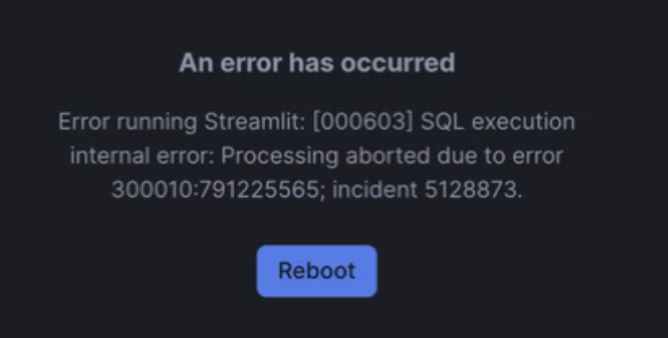

# semantic-model-generator

> [!NOTE]  
> The Semantic Model Generator in Streamlit has been replaced by the native [Cortex Analyst Semantic View Generator in Snowsight](https://docs.snowflake.com/en/user-guide/views-semantic/ui). Please use the native semantic generation moving forward. The team is actively working to support translating existing semantic layers from partner tools into consumable semantic models in Snowflake.

The `Semantic Model Generator` is an open-source tool used to generate and curate a semantic model for Snowflake [Cortex Analyst](https://docs.snowflake.com/en/user-guide/snowflake-cortex/cortex-analyst).

The tool is rendered as a Streamlit application, which can be started in [Streamlit in Snowflake](https://docs.snowflake.com/en/developer-guide/streamlit/about-streamlit) or locally with open-source Streamlit.
Setup instructions are separated below for the two methods - Please proceed to your preferred deployment method: [SiS deployment](#streamlit-in-snowflake-deployment) or [local deployment](#local-deployment).

If you want to see what a semantic model looks like, skip to [Examples](#examples).

## Table of Contents

* [Table of Contents](#table-of-contents)
* [Streamlit in Snowflake Deployment](#streamlit-in-snowflake-deployment)
* [Local Deployment](#local-deployment)
* [Partner Tool Translation](#partner-tool-translation)
* [Callable Semantic Generation](#callable-semantic-generation)
* [Usage](#usage)
    + [Semantic Model Context Length Constraints](#semantic-model-context-length-constraints)
    + [Auto-Generated Descriptions](#auto-generated-descriptions)
    + [Additional Fields to Fill Out](#additional-fields-to-fill-out)
* [Examples](#examples)
* [Release](#release)

## Streamlit in Snowflake Deployment

> **Note**: Deploying this app in Streamlit in Snowflake requires support for python 3.9+ in Streamlit in Snowflake.  This feature is part of the 2024-08 BCR (Behavior Change Bundle) which is currently **disabled by default**.  A user with ACCOUNTADMIN privileges can enable this feature in your account by running the following code in Snowsight:
> 
```sql
SELECT SYSTEM$ENABLE_BEHAVIOR_CHANGE_BUNDLE('2024_08');
```
> You can check to see if this BCR is already enabled by running:
```sql
SELECT SYSTEM$BEHAVIOR_CHANGE_BUNDLE_STATUS('2024_08');
```
> A typical error you might see if you do not have this feature enabled looks like this:


> For more information on this bundle please see our [BCR Documentation](https://docs.snowflake.com/en/release-notes/behavior-changes).


[Snowflake CLI](https://docs.snowflake.com/en/developer-guide/snowflake-cli-v2/index) is recommended for deploying the app in Streamlit in Snowflake. Please see Snowflake CLI [installation instructions](https://docs.snowflake.com/en/developer-guide/snowflake-cli-v2/installation/installation) to install. **Snowflake CLI version 3.0+ is recommended**. Follow the below instructions to install the Semantic Model Generator in Streamlit in Snowflake.

If you do not have Snowflake CLI installed, the setup can be replicated manually with the [VS Code Snowflake extension](https://docs.snowflake.com/en/user-guide/vscode-ext), Snowsight or [Snowflake Native Git Integration](https://docs.snowflake.com/en/developer-guide/git/git-overview):
 - If using Snowsight, you may use the files upload wizard to upload files. Please pay close attention to maintain the directory structure referenced in `setup_sis/app_setup.sql`.
 - If using the Native Git Integration, copy and paste the code from this [setup file](https://github.com/Snowflake-Labs/semantic-model-generator/blob/main/sis_setup/sissetup_snowsightgit.sql) and run in Snowsight. 

### Snowflake CLI Installation

1. Configure Snowflake CLI

Follow [instructions](https://docs.snowflake.com/en/developer-guide/snowflake-cli-v2/connecting/specify-credentials) for your preferred connection method to connect Snowflake CLI to your Snowflake account. Please [test](https://docs.snowflake.com/en/developer-guide/snowflake-cli-v2/connecting/manage-connections#label-snowcli-connection-test) your connection. Depending on your connection configuration, you may need to continue passing credentials for subsequent Snowflake CLI commands.

2. Deploy app in Streamlit in Snowflake

Run the below command from the project root directory to create all necessary objects in Snowflake. 

**Hint**: The owner of the app will be the role specified in your Snowflake CLI connection. To use a different role, append `--role <DESIRED_ROLE>` to the end of the command, replacing `<DESIRED_ROLE>`.

```bash
snow sql -f sis_setup/app_setup.sql
```

The app, titled Semantic Model Generator can be opened directly in Snowsight. Alternatively, you may run the below command in your terminal to open it.

```bash
snow streamlit get-url SEMANTIC_MODEL_GENERATOR --open --database cortex_analyst_semantics --schema semantic_model_generator
```

### **OPTIONAL**: Setup Looker Integration

The Semantic Model Generator supports translating metadata from a Looker Explore. To add this functionality to the Streamlit in Snowflake app, we need to create an external access integration to allow Snowflake to reach your Looker instance. 

Have the following information available:
- `<LOOKER_URL>`: [Looker Base URL](https://cloud.google.com/looker/docs/admin-panel-platform-api#api_host_url). Pass the domain excluding https:// such as snowflakedemo.looker.com.
- `<CLIENT_SECRET>`: [Looker Client Secret](https://cloud.google.com/looker/docs/api-auth#authentication_with_an_sdk)
- `<APP_ROLE>`: the owning role used in step #2 above

If using the CLI method, run the below command to create the external access integration. Before running, replace the parameters.

**Hint**: Creating external access integrations may require increased privileges. To use a different role from what is specified in your Snowflake CLI connection, append `--role <DESIRED_ROLE>` to the end of the command, replacing `<DESIRED_ROLE>`.

```bash
snow sql -f sis_setup/looker_integration.sql -D "looker_url=<LOOKER_URL>" -D "client_secret=<CLIENT_SECRET>" -D "streamlit_role=<APP_ROLE>"
```
If using any other method (e.g., Git Integration), you will need to update and run [looker_integration.sql](https://github.com/Snowflake-Labs/semantic-model-generator/blob/main/sis_setup/looker_integration.sql) in Snowsight with these variables replaced.

## Local Deployment

Local usage of the Streamlit app offers Snowflake connections via [Snowflake connections.toml](https://docs.snowflake.com/en/developer-guide/python-connector/python-connector-connect#connecting-using-the-connections-toml-file) OR environment variables. The app will first check for a connections.toml before using environment variables. Please follow the setup for your desired method and continue to [Start Local Streamlit App](#start-local-streamlit-app) once completed.

### Setup connections.toml (Option 1)
The Snowflake Python connector lets you add connection definitions to a connections.toml configuration file. A connection definition refers to a collection of connection-related parameters. Snowflake Python libraries currently support TOML version 1.0.0.

Please follow these [instructions](https://docs.snowflake.com/en/developer-guide/python-connector/python-connector-connect#connecting-using-the-connections-toml-file) to create the appropriate connections.toml file. For convenience, we recommend setting the desired connection as your default.

### Environment Variables (Option 2)
At minimum, the below environment variables are required if using this method to connect to Snowflake.

```bash
SNOWFLAKE_ROLE
SNOWFLAKE_WAREHOUSE
SNOWFLAKE_USER
SNOWFLAKE_ACCOUNT_LOCATOR
SNOWFLAKE_HOST
```

For your convenience, we have created examples of setting these environment variables in [`.env.example`](.env.example). If using environment variables, we recommend creating a `.env` file in the root directory of this repo. Please feel free to set your environment variables directly in terminal if preferred.

To find your Account locator, please execute the following sql command in your account.

```sql
SELECT CURRENT_ACCOUNT_LOCATOR();
```

B. To find the `SNOWFLAKE_HOST` for your
account, [follow these instructions](https://docs.snowflake.com/en/user-guide/organizations-connect#connecting-with-a-url). The easiest way to find your account URL is to click the `Copy account URL` button from the Account panel in Snowsight: 


However, if you have trouble authenticating with this URL, you can try building the URL manually:
* Currently we recommend you to look under the `Account locator (legacy)` method of connection for better compatibility on API.
* It typically follows format of: `<accountlocator>.<region>.<cloud>.snowflakecomputing.com`. Ensure that you omit
  the `https://` prefix.

Our semantic model generator currently support three types of authentication. 
If no `SNOWFLAKE_AUTHENTICATOR` environment variable is set, the default is `snowflake`, which uses standard username/password support (#1 below).

1. Username and Password

Set the below environment variables:
```bash
SNOWFLAKE_USER="<your-snowflake-username>" 
SNOWFLAKE_PASSWORD="<your-snowflake-password>" 
```
If you have MFA enabled, using this default authenticator should send a push notification to your device.

2. Username/Password with MFA passcode

Using a passcode from your authenticator app:

```bash
SNOWFLAKE_AUTHENTICATOR="username_password_mfa"
SNOWFLAKE_PASSWORD="<your-snowflake-password>"
SNOWFLAKE_MFA_PASSCODE="<your-snowflake-mfa-passcode>" # if your authenticator app reads "123 456", fill in "123456" (No spaces)
```

Using a passcode embedded in the password:

```bash
SNOWFLAKE_AUTHENTICATOR="username_password_mfa"
SNOWFLAKE_PASSWORD="<your-snowflake-password>"
SNOWFLAKE_MFA_PASSCODE_IN_PASSWORD="true"
```

3. Single Sign-On (SSO) with Okta

```bash
# no SNOWFLAKE_PASSWORD needed
SNOWFLAKE_AUTHENTICATOR="externalbrowser"
```

### Start Local Streamlit App

Once you have completed 1 of the 2 setup options above, you're ready to start the local Streamlit app.

1) If you have Make on your machine, run the below command to install dependencies for the Streamlit app.

```bash
make setup_admin_app
```

This uses `pip` to install dependencies from the root `pyproject.toml`. Feel free to use `conda` or any package manager
you prefer. Below is an alternative to the Make command.
```bash
pip install .
```

The generator supports merging data from your existing semantic models built with partners such as dbt and Looker. To
use the Looker-specific features, please use the below command to install the extras. This is only required for looker translation.

```bash
pip install -e ".[looker]"
```

2) You can run the app using the provided Makefile target if you have Make on your machine.

```bash
make run_admin_app
```

Alternatively, you can use your current version of Python to start the app manually. Please use Python 3.8-3.11.

```bash
python3 -m streamlit run app.py
```

## Partner Semantic Translation

We continue to add support for partner semantic and metric layers. Our aim is to expedite the creation of Cortex Analyst
semantic files using logic and metadata from partner tools.
Please see below for details about current partner support.

**IMPORTANT**: Instructions for each of the below sources are provided in the Streamlit application.

| Source   | Method                                                                                                                                                                                                                                       | Requirements                                                                                                                                                                                                                                                                                                                                                                                                             |
|--------|----------------------------------------------------------------------------------------------------------------------------------------------------------------------------------------------------------------------------------------------|--------------------------------------------------------------------------------------------------------------------------------------------------------------------------------------------------------------------------------------------------------------------------------------------------------------------------------------------------------------------------------------------------------------------------|
| DBT Semantic Model   | We extract and translate metadata from [semantic_models](https://docs.getdbt.com/docs/build/semantic-models#semantic-models-components) in uploaded DBT yaml file(s) and merge with a generated Cortex Analyst semantic file table-by-table. | DBT models and sources leading up to the semantic model layer(s) must be tables/views in Snowflake. |
| DBT SQL Model | DBT SQL Models should be materialized in Snowflake with persist docs to capture comments. A new semantic file can be generated for these newly materialized tables/views in Snowflake directly.| |
| Looker Explore | We materialize your Explore dataset in Looker as Snowflake table(s) and generate a Cortex Analyst semantic file. Metadata from your Explore fields can be merged with the generated Cortex Analyst semantic file.                            | Looker Views referenced in the Looker Explores must be tables/views in Snowflake. Looker SDK credentials are required. Visit [Looker Authentication SDK Docs](https://cloud.google.com/looker/docs/api-auth#authentication_with_an_sdk) for more information. Install Looker's [API Explorer extension](https://cloud.google.com/looker/docs/api-explorer) from the Looker Marketplace to view API credentials directly. |

## Callable Semantic Generation

A semantic model for table(s) can be generated in a callable fashion using the below stored procedure:

```sql
CORTEX_ANALYST_SEMANTICS.SEMANTIC_MODEL_GENERATOR.GENERATE_SEMANTIC_FILE(
    STAGE_NAME STRING,
    MODEL_NAME STRING,
    SAMPLE_VALUE INT,
    ALLOW_JOINS BOOLEAN,
    TABLE_LIST ARRAY
)
```

Calling the stored procedure will generate and upload a **minimal** semantic model YAML file to the specified Snowflake stage. Below is an example of calling the stored procedure for a single table. 

```sql
CALL CORTEX_ANALYST_SEMANTICS.SEMANTIC_MODEL_GENERATOR.GENERATE_SEMANTIC_FILE(
'CATRANSLATOR.ANALYTICS.DATA',
'MY_SEMANTIC_MODEL',
5,
False,
['CATRANSLATOR.ANALYTICS.CUSTOMERS']
);
```
Please note that high accuracy generally requires hands-on curation beyond that of a minimal semantic model.

## Usage

### Semantic Model Context Length Constraints

Due to context window as well as quality constraints, we currently limit the size of the generated semantic model to <
30,980 tokens (~123,920 characters).

Please note sample values and verified queries is not counted into this token length constraints. You can include as
many sample values or verified queries as you'd like with limiting the overall file to <1MB.

### Auto-Generated Descriptions

If your snowflake tables and comments do not have comments, we currently
leverages [cortex LLM function](https://docs.snowflake.com/en/user-guide/snowflake-cortex/llm-functions) to
auto-generate description suggestions. Those generation are suffixed with '__' and additional comment to remind you to
confirm/modity the descriptions.

### Additional Fields to Fill Out

**IMPORTANT**: After generation, your YAML files will have a series of lines with `# <FILL-OUT>`. Please take the time
to fill these out with your business context, or else subsequent validation of your model will fail.

By default, the generated semantic model will contain all columns from the provided tables/views. However, it's highly
encouraged to only keep relevant columns and drop any unwanted columns from the generated semantic model.

In addition, consider adding the following elements to your semantic model:

1. Logical columns for a given table/view that are expressions over physical columns.
    * Example: `col1 - col2` could be the `expr` for a logical column.
2. Synonyms. Any additional synonyms for column names.
3. Filters. Additional filters with their relevant `expr`.

## Examples

If you have an example table in your account with the following DDL statements.

```sql
CREATE TABLE sales.public.sd_data
(
    id    SERIAL PRIMARY KEY,
    dt    DATETIME,
    cat   VARCHAR(255),
    loc   VARCHAR(255),
    cntry VARCHAR(255),
    chn   VARCHAR(50),
    amt   DECIMAL(10, 2),
    unts  INT,
    cst   DECIMAL(10, 2)
);
```

Here is an example semantic model, with data elements automatically generated from this repo and filled out by a user.

```yaml
# Name and description of the semantic model.
name: Sales Data
description: This semantic model can be used for asking questions over the sales data.

# A semantic model can contain one or more tables.
tables:

  # A logical table on top of the 'sd_data' base table.
  - name: sales_data
    description: A logical table capturing daily sales information across different store locations and product categories.

    # The fully qualified name of the base table.
    base_table:
      database: sales
      schema: public
      table: sd_data

    # Dimension columns in the logical table.
    dimensions:
      - name: product_category
        synonyms:
          - "item_category"
          - "product_type"
        description: The category of the product sold.
        expr: cat
        data_type: NUMBER
        unique: false
        sample_values:
          - "501"
          - "544"

      - name: store_country
        description: The country where the sale took place.
        expr: cntry
        data_type: TEXT
        unique: false
        sample_values:
          - "USA"
          - "GBR"

      - name: sales_channel
        synonyms:
          - "channel"
          - "distribution_channel"
        description: The channel through which the sale was made.
        expr: chn
        data_type: TEXT
        unique: false
        sample_values:
          - "FB"
          - "GOOGLE"

    # Time dimension columns in the logical table.
    time_dimensions:
      - name: sale_timestamp
        synonyms:
          - "time_of_sale"
          - "transaction_time"
        description: The time when the sale occurred. In UTC.
        expr: dt
        data_type: TIMESTAMP
        unique: false

    # Measure columns in the logical table.
    measures:
      - name: sales_amount
        synonyms:
          - "revenue"
          - "total_sales"
        description: The total amount of money generated from the sale.
        expr: amt
        data_type: NUMBER
        default_aggregation: sum

      - name: sales_tax
        description: The sales tax paid for this sale.
        expr: amt * 0.0975
        data_type: NUMBER
        default_aggregation: sum

      - name: units_sold
        synonyms:
          - "quantity_sold"
          - "number_of_units"
        description: The number of units sold in the transaction.
        expr: unts
        data_type: NUMBER
        default_aggregation: sum

      - name: cost
        description: The cost of the product sold.
        expr: cst
        data_type: NUMBER
        default_aggregation: sum

      - name: profit
        synonyms:
          - "earnings"
          - "net income"
        description: The profit generated from a sale.
        expr: amt - cst
        data_type: NUMBER
        default_aggregation: sum

    # A table can define commonly used filters over it. These filters can then be referenced in user questions directly.
    filters:
      - name: north_america
        synonyms:
          - "North America"
          - "N.A."
          - "NA"
        description: "A filter to restrict only to north american countries"
        expr: cntry IN ('canada', 'mexico', 'usa')
```

## Release

In order to push a new build and release, follow the steps below. Note, only admins are allowed to push `release/v`
tags.

You should follow the setup commands from usage-cli to install poetry and create your environment.

1. Checkout a new branch from main. You should name this branch `release/vYYYY-MM-DD`.
2. Bump the poetry:
    * `poetry version patch` - increments `0.1.x` to `0.1.(x+1)`
    * `poetry version minor` - increments `0.x.0` to `0.(x+1).0`
    * `poetry version major` - increments `x.0.0` to `(x+1).0.0`
3. Update the `CHANGELOG.md` adding a relevant header for your version number along with a description of the changes
   made.
4. Run `make build` to create a new .whl file.
5. Push your files for approval.
6. After approval, run `make release` which will cut a new release and attach the .whl file.
7. Merge in your pr.

- Note: If you `make release` does not trigger the GH action. Please delete the tag and push again.
